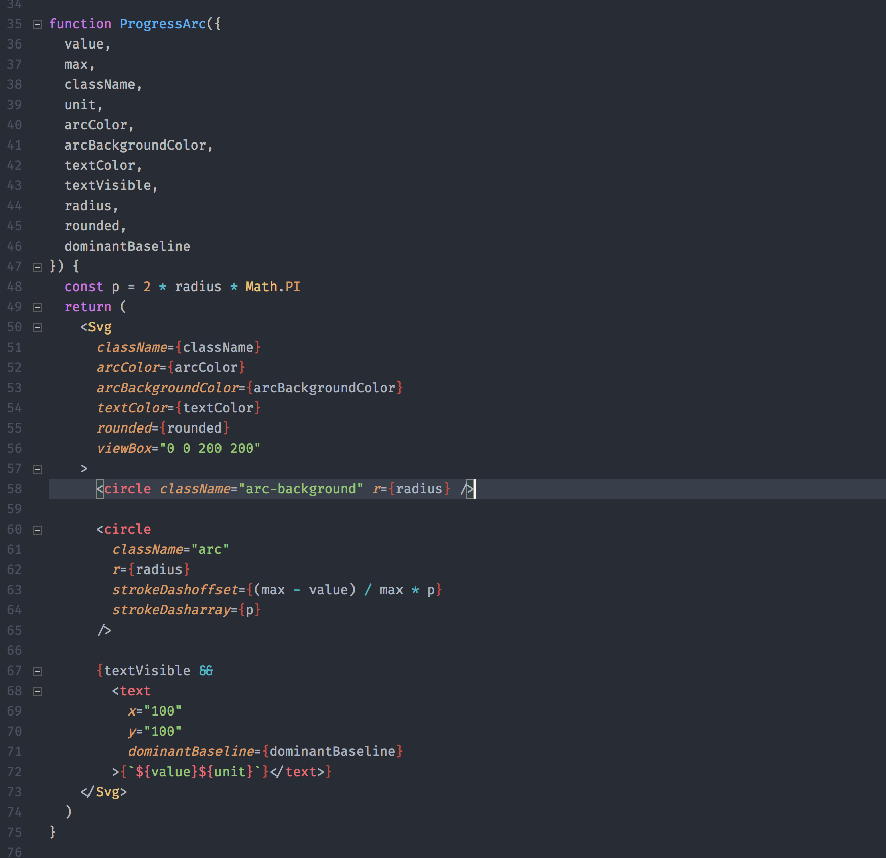
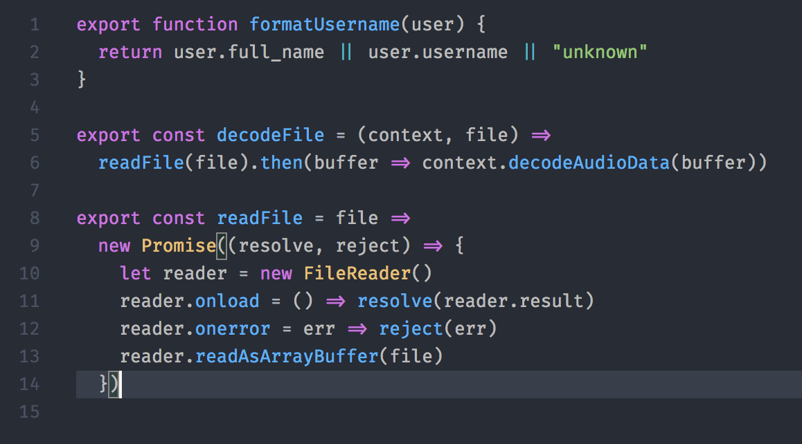
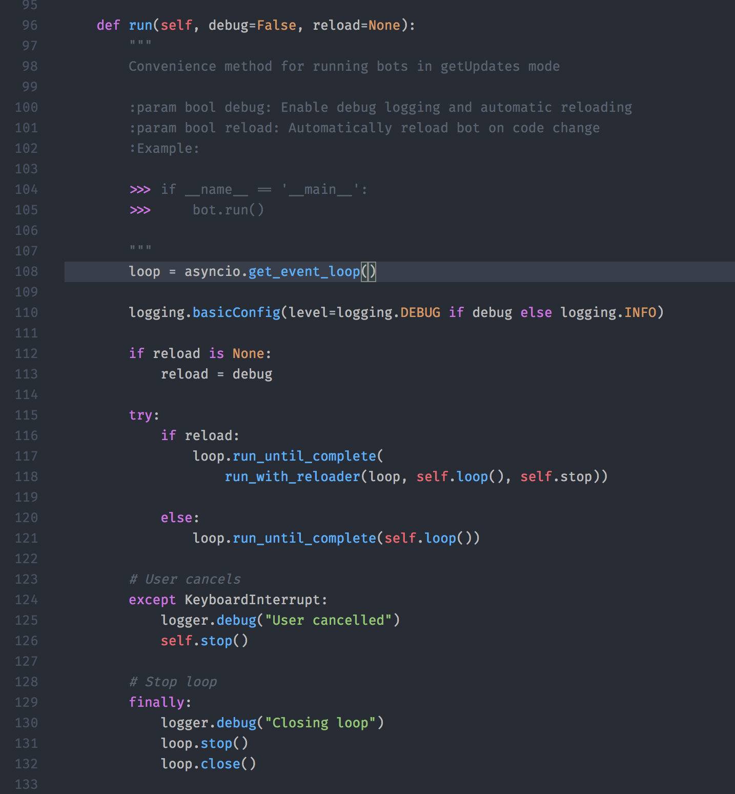

# One Dark Pale

Do you enjoy the aesthetics of One Dark but the redness of your JavaScript code makes your eyes bleed?

Well, try One Dark Pale 😉

## Javascript

No more red all over your JavaScript!

Functions are carefully colored to maintain visual hierarchy.

## Python

Dimmed docstrings, calm colors.

